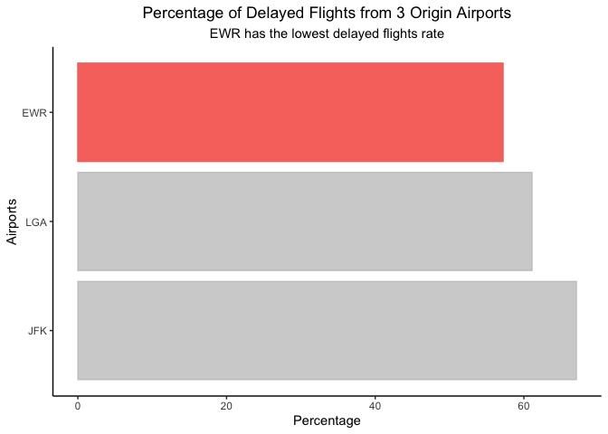
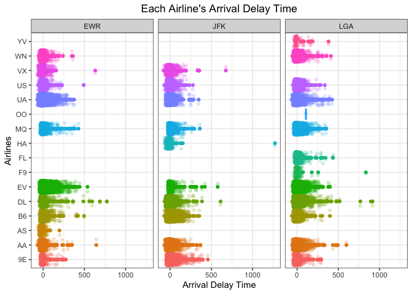

### Background
***
You just started your internship at a big firm in New York, and your manager gave you an extensive file of flights that departed from JFK, LGA, or EWR in 2013. From this data (which you can obtain in R) your manager wants you to answer several questions.

### Introduction
***
In this project, we analyzed the flights departed from JFK, LGA, and EWR in 2013. Our findings are: Alaska Airline, Virgin Airline, Delta Airline, and American Airline are top choices for travelers if they want to avoid flight delays._

Meanwhile, judging by average arrival delay time by minutes, the data indicates that Columbia Metropolitan Airport (CAE) is the worst airport for arrival flights.


```r
library(tidyverse)
library(nycflights13)
library(viridis)
library(pander)
library(gghighlight)
# https://ourworldindata.org/what-is-depression
```

### Question 1
***
#### Which two airlines have the lowest arrival dealy time at the 75th percentile at each airport for flights departing before noon?

I would recommend choosing Alaska Airline (AS) and Virgin Airline (VX) for EWR airport. Delta (DL), VX, and American Airline (AA) for JFK airport because VX and AA have the same arrival delay. As for LGA airport, AA and VX are two recommended ones.


```r
# filter sched_dep_time to before noon 
flights2 <- filter(flights, sched_dep_time <= 1200)
```


```r
# boxplot graph for comparision 
chart1 <- ggplot(flights2, aes(x=carrier, y=arr_delay, fill=carrier))+
  geom_boxplot(outlier.shape=NA)+
  facet_wrap(origin~.)+
  # change the x axis limits to zoom in 
  scale_y_continuous(limits = c(-80, 120))+
  labs(
    title="Each Airline's Arrival Delay Time", 
    subtitle = "From Newark Liberty Airport (EWR), \nJohn F. Kennedy Airport, and LaGuardia Airport",
    y = "Arrival Delay Time", 
    x = "Airlines")+
  theme_bw()+
  # remove legend labels
  theme(legend.position="none")+
  # center title & subtitle
  theme(plot.title = element_text(hjust = 0.5), plot.subtitle = element_text(hjust = 0.5))+
  # flip x & y axes 
  coord_flip()
chart1
```

<!-- -->

```r
ggsave('chart1.png')
```
*Best 2 Airlines from EWR: AS & VX*


```r
EWR <- flights2 %>% 
  filter(origin == "EWR") %>%
  group_by(carrier) %>% 
  summarise(delay = quantile(arr_delay, probs = c(.75), na.rm=TRUE)) %>%
  arrange(delay) %>%
  top_n(-2, delay)
pander(EWR)
```


-----------------
 carrier   delay 
--------- -------
   AS       -9   

   VX       -2   
-----------------


*Best 2 Airlines from JFK: DL & AA & VX*


```r
JFK <- flights2 %>% 
  filter(origin == "JFK") %>%
  group_by(carrier) %>% 
  summarise(delay = quantile(arr_delay, probs = c(.75), na.rm=TRUE)) %>%
  arrange(delay) %>%
  top_n(-2, delay)
pander(JFK)
```


-----------------
 carrier   delay 
--------- -------
   DL        0   

   AA        2   

   VX        2   
-----------------

*Best 2 Airlines from LGA: AS & VX*


```r
LGA <- flights2 %>% 
  filter(origin == "EWR") %>%
  group_by(carrier) %>% 
  summarise(delay = quantile(arr_delay, probs = c(.75), na.rm=TRUE)) %>%
  arrange(delay) %>%
  top_n(-2, delay)
pander(LGA)
```


-----------------
 carrier   delay 
--------- -------
   AS       -9   

   VX       -2   
-----------------


### Question 2
***
#### Which origin airport is best to minimize my probability of a late arrival when I am using Delta Airlines?

According to the chart, EWR has the lowest percentage of late flights. Thus, when flying with Delta Airlines, choose EWR as the origin airport will be highly recommended.


```r
DL <- flights %>% 
      # filter Delta Airline
      filter(carrier=='DL') %>%
      # determine if the flight is late or not
      mutate(DL_arr_delay = case_when(arr_delay < 0 ~ 'Late', 
                                      TRUE ~ 'Not Late')) %>% 
      group_by(origin, DL_arr_delay) %>% 
      summarise(dest_count = n()) %>% 
      pivot_wider(names_from = DL_arr_delay, values_from = dest_count) %>% 
      mutate_all(funs(replace_na(.,0))) %>% 
      mutate(percentage= round((Late/(Late+`Not Late`))*100, 2))
```


```r
chart2 <- ggplot(DL, aes(x=percentage, y=reorder(origin, -percentage), color=origin, fill=origin))+
          geom_bar(stat='identity')+
          labs(
            title = "Percentage of Delayed Flights from 3 Origin Airports", 
            subtitle = "EWR has the lowest delayed flights rate", 
            y = 'Airports', 
            x = 'Percentage'
          )+
          theme_classic()+
          theme(
            legend.position = 'none'
          )+
  theme(plot.title = element_text(hjust = 0.5), plot.subtitle = element_text(hjust = 0.5))+
  gghighlight(origin=="EWR")

chart2
```

<!-- -->

```r
ggsave('chart2.png')
```


### Question 3
***
#### Which destination airport is the worst airport for arrival time?

The definition of 'the worst airport' is measured by its average arrival delay time by minutes. The following chart shows 10 destination airports with the longest delay. CAE has an average of 41.76 minutes; thus, it is the worst airport for arrival time.


```r
dest_airport <- flights %>% 
                group_by(dest) %>% 
                summarise(delay = round(mean(arr_delay, na.rm = TRUE), 2)) %>% 
                arrange(desc(delay)) %>% 
                head(10)
```


```r
chart3 <- ggplot(dest_airport, aes(x=delay, y=reorder(dest, delay)))+
          geom_bar(stat = 'identity')+
          labs(
            title = 'Top 10 Destination Airports with \nLongest Average Arrival Delay Time',
            subtitle = 'CAE has the worst arrival delay',
            y = 'Destination Airport',
            x = 'Average Arrival Delay'
          )+
   theme(plot.title = element_text(hjust = 0.5), plot.subtitle = element_text(hjust = 0.5))+
  theme_classic()+
  # add annotation 
  geom_text(aes(label=delay),vjust=0,hjust=0)
chart3
```

<!-- -->

```r
ggsave('chart3.png')
```


### Showing Complexity
***

> Pro: Can identify the outliers, meaning we can point out those extreme arrival delay for each airline.
> Con: Lose visibility of boxplots because there are too many flights (points).


```r
chart4 <- ggplot(flights2, aes(x=carrier, y=arr_delay, fill=carrier, color=carrier))+
  geom_boxplot()+
  geom_jitter(alpha=.2)+
  facet_wrap(origin~.)+
  labs(
    title="Each Airline's Arrival Delay Time", 
    y = "Arrival Delay Time", 
    x = "Airlines")+
  theme_bw()+
  theme(legend.position="none")+
  theme(plot.title = element_text(hjust = 0.5), plot.subtitle = element_text(hjust = 0.5))+
  coord_flip()
chart4
```

<!-- -->

```r
ggsave('chart4.png', width=15)
```


