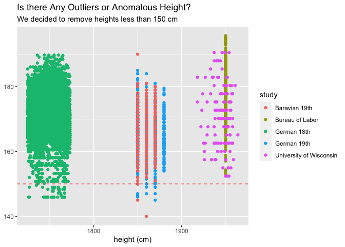
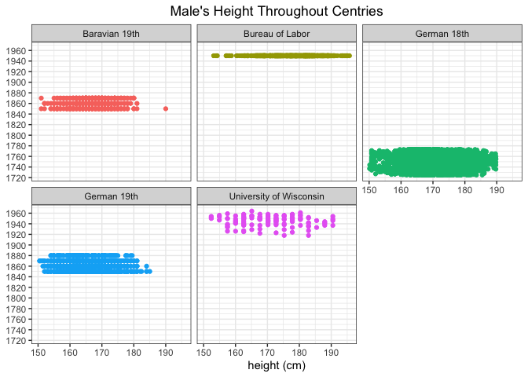

<style type="text/css">
  body{
  font-size: 12pt;
}
</style>


```r
library(haven)
library(readr)
library(foreign)
library(readxl)
library(tidyverse)
```

### Background
***
The Scientific American argues that humans have been getting taller over the years. As data scientists in training, we would like to use data to validate this hypothesis. This case study will use many different datasets, each with male heights from different years and countries. Our challenge is to combine the datasets and visualize heights across the centuries.

### Introduction 
***
In this project, we take 5 data sets from different sources recording male heights in different time, wrangle, tidy, and combine them into a new organized data set with the column names: birth_year, height.cm, height.in, study. 

We then use this new data set to create charts and analyze the trend of human height. With the provided visualization, we can confirm or dispute the hypothesis of humans getting taller over time. 


```r
german_19th_url <- "https://byuistats.github.io/M335/data/heights/germanconscr.dta"
dgerman_19 <- read_dta(german_19th_url)
german_18th_url <- "https://byuistats.github.io/M335/data/heights/Heights_south-east.zip"
library(downloader)
library(fs)
temp <- tempfile()
downloader::download(url = german_18th_url, destfile = temp, mode = "wb")
unzip <- unzip(temp)
dgerman_18 <- read.dbf(unzip)
fs::file_delete(temp)
baravian_19th_url <- "https://byuistats.github.io/M335/data/heights/germanprison.dta"
dbaravian_19 <- read_dta(baravian_19th_url)
height_url <- "https://raw.githubusercontent.com/hadley/r4ds/main/data/heights.csv"
dheight <- read_csv(height_url)
nsd_url <- "http://www.ssc.wisc.edu/nsfh/wave3/NSFH3%20Apr%202005%20release/main05022005.sav"
dnsd <- read_sav(nsd_url)
```

### Data Wrangling Process
***
> To get the ultimate tidy data set, 

1. Decide the needed final columns: birth_year, height in cm, height in inches, study sources. 

2. Observe the provided 5 data sets and decide which columns we could use. 
For example, german_1, we take GEBJ as birth_year, CMETER as height.cm. Then take CMETER and convert it into inches (multipy by 0.393701) and create a new column. 

3. Wrangle the data. 4 out of the 5 data sets are relatively similar. However, data from Wisconsin National Survey is a little bit tricky. I had to reference codebook for column explanation and find the needed columns. Meanwhile, I first filtered male respondents from the data. As for the height, since the columns are separated into feet and inches, I converted them and added them together. 

4. Combine 5 data sets together. Because I have already wrangled all data sets into the same columns, I only needed to combine them together. 

5. Remove outliers. I created a boxplot to see what height is out of ordinary. From the chart, I decided to remove any height that is below 150 cm. 


```r
# Data Set: dgerman_18
ndgerman_18 <- dgerman_18 %>% 
        # birth_year column 
  mutate(birth_year = GEBJ, 
         # height.cm
         height.cm = CMETER,
         # height.in
         height.in = CMETER * 0.393701, 
         # study
         study = "German 18th"
         ) %>% 
  # select the above columns
  select(birth_year:study)
```


```r
# Data Set: dgerman_19
ndgerman_19 <- dgerman_19 %>% 
        # birth_year column 
  mutate(birth_year = bdec, 
         # height.cm
         height.cm = height, 
         # height.in
         height.in = height* 0.393701, 
         # study
         study = "German 19th") %>% 
  # select the above columns
  select(birth_year:study)
```


```r
# Data Set: dbaravian_19
ndbaravian_19 <- dbaravian_19 %>% 
        # birth_year column 
  mutate(birth_year = bdec, 
         # height.cm
         height.cm = height, 
         # height.in
         height.in = height* 0.393701, 
         # study
         study = "Baravian 19th"
         ) %>% 
  # select the above columns
  select(birth_year:study)
```


```r
# Data Set: dheight
ndheight <- dheight %>% 
  # filter male
  filter(sex == "male") %>% 
  # birth_year column 
  mutate(birth_year = 1950, 
         height.cm = height / 0.393701, 
         height.in = height, 
         study = "Bureau of Labor") %>% 
  # select the above columns
  select(birth_year:study)
```


```r
# Data Set: dnsd
ndnsd <- dnsd %>% 
  # filter male
  filter(RE35 == 1) %>% 
        # birth_year column 
  mutate(birth_year = DOBY + 1900,
         # height.cm
         height.cm = (RT216F * 12 + RT216I) / 0.393701,
         # height.in
         height.in = RT216F * 12 + RT216I, 
         # study
         study = "University of Wisconsin") %>% 
  select(birth_year:study)
```


```r
# Combine 5 data sets together
dat <- rbind(ndgerman_18, ndgerman_19, ndbaravian_19, ndheight, ndnsd)
```


```r
# Examine if there is outlier or anomalous height
ggplot(dat, aes(x = birth_year, y = height.cm, color = study))+
  geom_point()+
  labs(
    title = "Is there Any Outliers or Anomalous Height?", 
    subtitle = "We decided to remove heights less than 150 cm",
    x = "height (cm)"
  )+
  ylab(NULL)+
  geom_hline(yintercept = 150, linetype = "dashed", color = "red")
```

<!-- -->


```r
# Remove outliers: height.cm < 150
dat <- dat %>% 
  filter(height.cm > 150)
```

### Individual Heights Chart
***

```r
dat %>% 
  ggplot(aes(x = height.cm, y = birth_year, color = study))+
  geom_point()+
  facet_wrap(study~.)+
  scale_y_continuous(breaks = c(1720, 1740, 1760, 1780, 1800, 1820, 1840, 1860, 1880, 1900, 1920, 1940, 1960), 
                     labels = c(1720, 1740, 1760, 1780, 1800, 1820, 1840, 1860, 1880, 1900, 1920, 1940, 1960))+
  theme_bw()+
  ylab(NULL)+
  labs(
    title = "Male's Height Throughout Centries", 
    x = "height (cm)"
  )+
  theme(
    legend.position = "none", 
    plot.title = element_text(hjust = 0.5)
  )
```

<!-- -->

### Data Summary
***
There is no obvious or strong evidence supporting the claim that humans get taller over time. There is; however, a clear trend if we break down into 17th, 18th, and 19th century. From 1720 to 1760, we notice that the male average height increased but soon declined after reaching the peak. 

18th Century has the lowest average height in the period of 300 years, with the shortest being 165 cm (5'41). 
Surprisingly, as we marched into 19th Century, the numbers demonstrate some extreme cases. The tallest is 179 cm (5'87) while the shortest is 168 cm (5'51). Meanwhile, excluding the outlier (168 cm), the rest of average height in 19th Century is above 170 cm (5'57)

In conclusion, if broken down into 3 centuries, we realize that human (male) height is not a steady increase but instead goes thorugh its ups and downs. 


```r
dat %>% 
  mutate(decade = case_when(birth_year >= 1960 ~ 1960,
                            birth_year >= 1950 ~ 1950, 
                            birth_year >= 1940 ~ 1940, 
                            birth_year >= 1930 ~ 1930, 
                            birth_year >= 1920 ~ 1920, 
                            birth_year >= 1910 ~ 1910, 
                            birth_year >= 1900 ~ 1900, 
                            birth_year >= 1880 ~ 1880, 
                            birth_year >= 1870 ~ 1870, 
                            birth_year >= 1860 ~ 1860, 
                            birth_year >= 1850 ~ 1850, 
                            birth_year >= 1770 ~ 1770, 
                            birth_year >= 1760 ~ 1760,
                            birth_year >= 1750 ~ 1750, 
                            birth_year >= 1740 ~ 1740, 
                            birth_year >= 1730 ~ 1730, 
                            birth_year >= 1720 ~ 1720
                            )) %>% 
  separate(decade, into=c("century", NA), sep = 2, remove = FALSE) %>% 
  group_by(decade) %>% 
  mutate(ave_height = sum(height.cm)/n()) %>% 
  arrange(decade) %>%
  ggplot(aes(x = decade, y = ave_height, color=century))+
  geom_line(color="black")+
  geom_point()+
  scale_y_continuous(limit = c(160, 180), breaks = c(160, 165, 170, 175, 180),
                     labels = c(160, 165, 170, 175, 180)
  )+
  scale_x_continuous(breaks = c(1720, 1740, 1760, 1780, 1800, 1820, 1840, 1860, 1880, 1900, 1920, 1940, 1960), 
                     labels = c(1720, 1740, 1760, 1780, 1800, 1820, 1840, 1860, 1880, 1900, 1920, 1940, 1960))+
  labs(
    title = "Average Male Height from 1720-1960", 
    subtitle = "1. 17th Century: The average height is mostly above 170 cm and has the smallest standard deviation\n2. 18th Century: Male are the shortest compared to others from the other 2 centuries \n3. 19th Century: 19th Century has the most extreme data, but overall, the average height is also above 170 cm", 
    y = "height (cm)"
  )+
  xlab(NULL)+
  theme_bw()+
  theme(
        panel.grid.major = element_line(linetype = "dashed"),
        panel.grid.minor = element_line(linetype = "dashed"), 
        legend.position = "none"
  )+
  annotate("text", x = 1750, y = 169, label = "17th Century")+
  annotate("text", x = 1930, y = 177, label = "19th Century")+
  annotate("text", x = 1865, y = 164, label = "18th Century")+
  geom_hline(yintercept = 170, linetype = "dashed", color = "red")
```

<!-- -->

