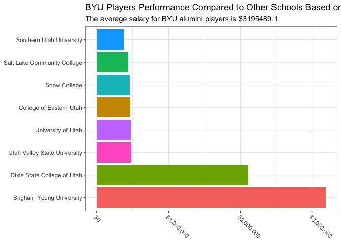
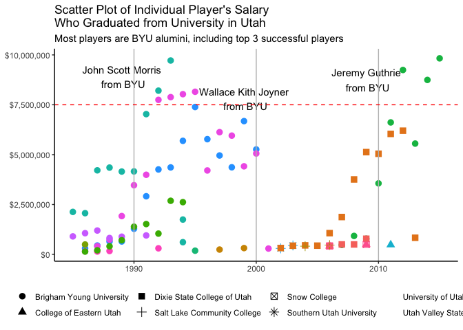

<style type="text/css">
  body{
  font-size: 12pt;
}
</style>


```r
library(Lahman)
library(priceR)
library(tidyverse)
library(pander)
```

### Background
***
Over the campfire, you and a friend get into a debate about which college in Utah has had the best MLB success. As an avid BYU fan, you want to prove your point and decide to use data to settle the debate.

You need a chart that summarizes the success of BYU college players compared to other Utah college players that have played in the major leagues. It would also be helpful to have a chart showing success of individual players that you can reference. For both of these charts, you decide to use player salary as a stand in for “success”.

### Introduction
***
This project aims to compare baseball player's performance who are Utah colleges' alumni. Salary is the primary factor used to determine their success. 

We pulled data from a couple of tables from Lahman library, including Schools, CollegePlaying, People, and Salaries table. Joining tables, filtering, and renaming columns are some of the applied skills. Additionally, we also considered inflation, converting previous years value to 2020. 


### Data Set Preview 
***
The following table shows the columns and first 5 rows of values. 

```r
dat <- Schools %>% 
  full_join(CollegePlaying) %>% 
  filter(state == "UT") %>% 
  select(name_full, playerID, yearID) %>% 
  group_by(playerID) %>% 
  mutate(most_recent_year = max(yearID)) %>% 
  distinct(name_full, playerID) %>% 
  left_join(People, by = "playerID") %>% 
  unite("full_name", nameGiven, nameLast, sep = " ") %>% 
  select(playerID, name_full, full_name) %>% 
  left_join(Salaries, by = "playerID") %>% 
  select(-teamID) %>% 
  rename("school" = name_full, "player" = full_name) %>% 
  # drop all rows with N/A
  na.omit()

# create a new column to adjust inflation 
dat$salary_2020 <- 
  adjust_for_inflation(price = dat$salary, 
                       from_date = dat$yearID, 
                       country = "US", 
                       to_date = 2020)
```

```
## Generating URL to request all 299 results
## Retrieving inflation data for US 
## Generating URL to request all 62 results
```

```r
dat <- dat %>% 
  select(-playerID)

dat1 <- dat %>% 
  head()

pander(dat1)
```


--------------------------------------------------------------------------------
 playerID             school                    player            yearID   lgID 
----------- -------------------------- ------------------------- -------- ------
 aguilri01   Brigham Young University   Richard Warren Aguilera    1986     NL  

 aguilri01   Brigham Young University   Richard Warren Aguilera    1987     NL  

 aguilri01   Brigham Young University   Richard Warren Aguilera    1988     NL  

 aguilri01   Brigham Young University   Richard Warren Aguilera    1989     NL  

 aguilri01   Brigham Young University   Richard Warren Aguilera    1990     AL  

 aguilri01   Brigham Young University   Richard Warren Aguilera    1991     AL  
--------------------------------------------------------------------------------

Table: Table continues below

 
-----------------------
 salary    salary_2020 
--------- -------------
 130000      306961    

 195000      444164    

 295000      645614    

 310000      647202    

 648000      1283574   

 1533333     2913862   
-----------------------


### Graph Insight
***
#### Chart 1: Average Salaries Comparison 


```r
byu_dat <- dat %>% 
  group_by(school) %>% 
  summarise(ave_salary = mean(salary_2020))

require(scales)
ggplot(byu_dat)+
  geom_bar(aes(y = fct_reorder(school, ave_salary, .desc = TRUE), x = ave_salary, fill = school), stat="identity")+
    theme_bw()+
  # labels = comma remove the scientific annotation 
  scale_x_continuous(labels=scales::dollar_format())+
  theme(axis.text.x = element_text(angle = -45, hjust =0))+
  xlab(NULL)+
  ylab(NULL)+
  labs(
    title = "BYU Players Performance Compared to Other Schools Based on Average Salaries ",
    subtitle = "The average salary for BYU alumini players is $3195489.1"
  )+
  theme(legend.position = "none")
```

<!-- -->

#### Chart 2: Individual Salary for Each Players 


```r
dat %>% 
  group_by(playerID) %>% 
  ggplot(aes(x = yearID, y = salary_2020, color = player, shape = school))+
  geom_point(size = 3)+
  annotate("text", x = 2009, y = 8745970, label = "Jeremy Guthrie\n from BYU")+
  annotate("text", x = 1989, y = 8900000, label = "John Scott Morris\n from BYU")+
  annotate("text", x = 1999, y = 7800000, label = "Wallace Kith Joyner\n from BYU")+
  scale_y_continuous(labels=scales::dollar_format())+
  theme_classic()+
  ylab(NULL)+
  xlab(NULL)+
  labs(
    title = "Scatter Plot of Individual Player's Salary\nWho Graduated from University in Utah ", 
    subtitle = "Most players are BYU alumini, including top 3 successful players"
  )+
  theme(
    legend.position = "bottom", 
    legend.title = element_blank()
  )+
  guides(color=FALSE)+
  geom_vline(xintercept = 1990, color = "grey")+
  geom_vline(xintercept = 2000, color = "grey")+
  geom_vline(xintercept = 2010, color = "grey")+
  geom_hline(yintercept = 7500000, color = "red", linetype ="dashed")
```

<!-- -->

### Findings
***
From chart 1, we compared the average salaries earned by players graduating from universities in Utah. We found out that BYU alumni players have more success than other Utah schools alumni. As for chart 2, the scatter plot supports our finding that BYU alumni players are more successful. Three of players who got paid the most all graduated from Brigham Young University. Moreover, it is shown that most players who graduated from Utah school are from BYU. 
