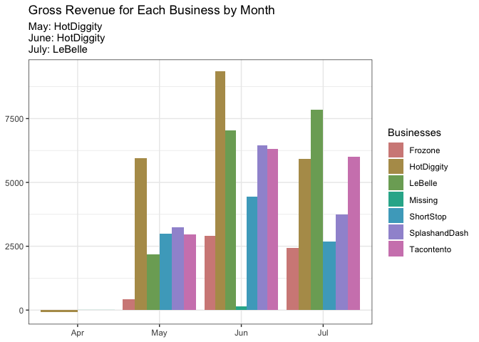
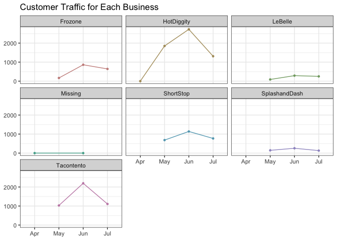

```r
library(tidyverse)
library(lubridate)
dat <- read_csv("https://byuistats.github.io/M335/data/sales.csv")
```

### Background
***
We have transaction data for a few businesses that have been in operation for three months. Each of these companies has come to your investment company for a loan to expand their business. Your boss has asked you to go through the transactions for each business and provide daily, weekly, and monthly gross revenue summaries and comparisons. Your boss would like a short write up with tables and visualizations that help with the decision of which company did the best over the three month period. You will also need to provide a short paragraph with your recommendation after building your analysis.


### Introduction 
***
In this case study, we take multiple businesses and analyze their sale performance during a certain period of time to determine which business makes the most money. 


### Best Performing Business (Gross Revenue)
***
To determine which business has the highest gross revenue, we decided to aggregate sales performance by month. Since we only have 1 business for April, we chose to exclude it from our analysis. 

From the below chart, it is indicated that HotDiggity earned the most money in May and June compared to all other companies. However, LeBelle is the top performer for July. 


```r
# convert time & add month, week, day columns 
dat <- dat %>% 
  # monthly, weekly, daily, hourly 
  mutate(new_time = with_tz(Time, tzone = "MST"),
         month = month(new_time, label = TRUE),
         week = wday(new_time, label = TRUE), 
         day = mday(new_time),
         hour = hour(floor_date(new_time, unit = "hour")))
```


```r
# monthly gross revenue
month_rev <- dat %>% 
  select(Name, month, Amount) %>% 
  group_by(Name, month) %>% 
  summarise(revenue_m = sum(Amount)) %>% 
  distinct(Name, month, revenue_m) 

month_rev %>% 
  ggplot(aes(y = revenue_m, x = month, fill = Name, group = Name))+
  geom_col(position = "dodge")+
  theme_bw()+
  labs(
    title = "Gross Revenue for Each Business by Month", 
    subtitle = "May: HotDiggity \nJune: HotDiggity \nJuly: LeBelle")+
  ylab(NULL)+
  xlab(NULL)+
  scale_fill_hue(c=50)+
  guides(fill = guide_legend(title = "Businesses"))
```

<!-- -->

### Hours of Operation 
***
In this analysis, we tracked the performance by hour in each day. We found a trend that during 10 am to 3 pm, each company had an increase sales. Among the companies, HotDiggity, LeBelle, and Tacontento have the most dramatic rise of sales. 


```r
hour_rev <- dat %>% 
  select(Name, hour, Amount) %>% 
  group_by(Name, hour) %>% 
  summarise(revenue_h = sum(Amount))

hour_rev %>% 
  ggplot(aes(x = hour, y = revenue_h, color = Name))+
  geom_line()+
  geom_point(size = 1)+
  facet_wrap(Name~.)+
  theme_bw()+
  theme(
    legend.position = "none"
  )+
  labs(
    title = "Gross Revenue for Each Business by Hour"
  )+
  ylab(NULL)+
  xlab(label = "hour in a day")+
  scale_color_hue(c = 40)
```

<!-- -->

### Customer Traffic  
***
For this last visualization, we assessed the amount of transactions for all companies. HotDiggity, Tacontento, and ShortStop have the top 3 highest traffic. This trend aligns with the sales chart. However, we found something interesting. Frozone has a relatively high traffic campared to LeBelle, but its total revenue is less than LeBelle. Therefore, we came to the conclusion that LeBelle probably has higher price for their service or product. 


```r
traffic <- dat %>% 
  group_by(Name, month) %>% 
  summarise(traffic = n())

traffic %>% 
  ggplot(aes(x = month, y = traffic, color = Name, group = 1))+
  geom_line()+
  geom_point(size = 1)+
  theme_bw()+
  facet_wrap(Name~.)+
  theme(
    legend.position = "none"
  )+
  xlab(NULL)+
  ylab(NULL)+
  labs(
    title = "Customer Traffic for Each Business"
  )+
  scale_color_hue(c = 40)
```

<!-- -->

### Conclusion Insight
***
Though there are some slight different trends depending on various time measurement level, we conclude that HotDiggity is the best business for investment because had the highest gross revenue over the three months. 
